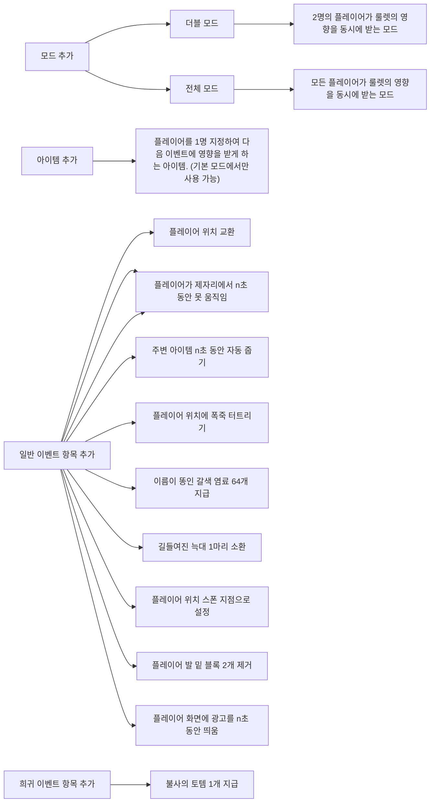

# 랜덤 이벤트 서바이벌

타이머를 통해 서버 내 플레이어를 선택하고 랜덤 이벤트를 제공하는 플러그인.

  

- Minecraft : 1.21.1 +
- api-version: 1.21

## 주요 기능

- 타이머가 동작하여 0초가 되면 플레이어와 이벤트를 선택하는 룰렛이 작동합니다. (기본 타이머 : 1분 30초)
- 플레이어는 서버 내 온라인을 기준으로 하며, 서버에 플레이어가 없을 경우 타이머가 작동하지 않습니다.
- 랜덤 이벤트 목록은 아래와 같습니다.

`일반 이벤트` : 발생 확률 99%

| 이벤트 이름    | 설명                                                     | 대상 플레이어 인원 | 이벤트 지속 시간 | 영문명                    |
| -------------- | -------------------------------------------------------- | ------------------ | ---------------- | ------------------------- |
| 아이템 삭제    | 플레이어 인벤토리에서 특정 아이템 1개를 삭제합니다.      | 1명                | 1번만            | item_remove               |
| 틱 속도 변경   | 게임 틱 속도가 랜덤하게 변경됩니다. (20, 100, 200, 1000) | 전체               | 30초             | tick_speed_change         |
| 체력 변경      | 플레이어의 체력이 강제로 변경됩니다. (1 ~ 20)            | 1명                | 1번만            | player_hp_change          |
| 시간 변경      | 시간이 낮 또는 밤으로 변경됩니다.                        | 전체               | 1번만            | time_change               |
| 핫바 섞기      | 핫바에 있는 아이템들 위치가 랜덤하게 섞입니다.           | 1명                | 1번만            | hotbar_change             |
| 랜덤 효과 부여 | 플레이어에게 랜덤 효과 1개를 부여합니다.                 | 1명                | 15초             | player_random_effect_give |
| tnt 소환       | 플레이어 위치에 점화된 tnt 1개를 소환합니다.             | 1명                | 1번만            | spawn_tnt                 |
| 날려보내기     | 플레이어를 저 위로 날려버립니다.                         | 1명                | 1번만            | yeet                      |

`희귀 이벤트` : 발생 확률 1%

| 이벤트 이름      | 설명                                                                                                                                                                                                                                                                                                                                         | 대상 플레이어 인원 | 이벤트 지속 시간 |
| ---------------- | -------------------------------------------------------------------------------------------------------------------------------------------------------------------------------------------------------------------------------------------------------------------------------------------------------------------------------------------- | ------------------ | ---------------- |
| 드래곤 체력 증가 | 엔더 드래곤의 체력이 영구적으로 100 추가됩니다.                                                                                                                                                                                                                                                                                              | X                  | 1번만            |
| Bob 소환         | 플레이어 위치에 Bob을 소환합니다.  Bob의 특징은 아래와 같습니다.  - 다이아몬드 갑옷 풀세트 - 폭발로부터 보호 16 - 화염으로부터 보호 16 - 발사체로부터 보호 16 - 보호 16 - 신속 255 무한 - 힘 255 무한 - 재생 255 무한 - 치유 255 무한 - 화염 저항 255 무한 - 수중 호흡 255 무한 - 저항 255 무한 | 1명                | 1번만            |

## 추후 로드맵

